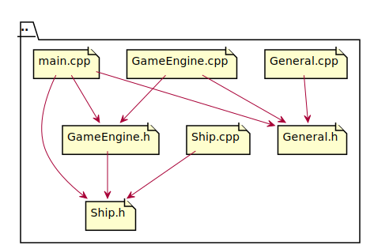
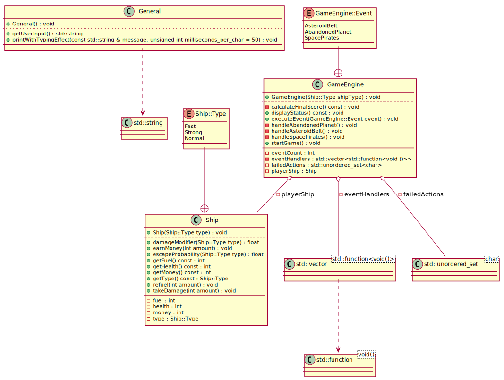

# BIL142Proje
Project Design For BIL142 Course in C++





# Space Adventure Game

## Description
Space Adventure Game is a console-based game where you navigate a spaceship through a series of events in space.

## Requirements
- CMake 3.10 or higher
- A C++17 compliant compiler

## Compilation Using Cmake
To compile the game, follow these steps:

1. Navigate to the root directory of the project.
2. Create a build directory:
    
    ```
    mkdir build && cd build
    ```
3. Generate the make file using CMake:

    ```
    cmake ..
    ```
4. Compile the project:

    ```
    make
    ```

## Compilation Using GCC

Run the following command:

```
    g++ -o SpaceAdventureGame GameEngine.cpp Ship.cpp main.cpp General.cpp
```

## Usage
After compiling, you can run the game by executing the binary:

```
    ./SpaceAdventureGame
```
